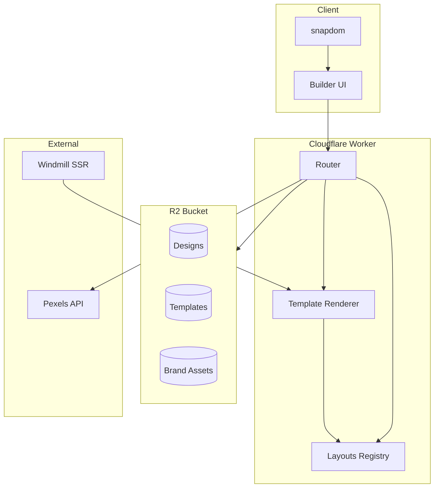

# 00-architecture-overview

SnapKit is a multi-brand thumbnail generator running on Cloudflare Workers. It renders HTML layouts to PNG via client-side capture (snapdom) or server-side rendering (Windmill/CamoFox).

## System Diagram

## Core Entities

| Entity | Description | Storage |
|--------|-------------|---------|
| Layout | HTML render function + params | Code (built-in) or inline TS (custom) |
| Template | Layout + Size + Brand + defaults | R2 `templates/` |
| Design | Saved user configuration | R2 `designs/` |
| BrandKit | Colors, fonts, logos, watermark | Code `data/brand-kits.ts` |
| SizePreset | Width × Height + category | Code `data/size-presets.ts` |

## Tech Stack

| Layer | Technology |
|-------|------------|
| Runtime | Cloudflare Workers |
| Storage | R2 (designs, templates, assets) |
| AI | Workers AI (search query) |
| Client Capture | snapdom v2.0.2 |
| Server Render | Windmill + CamoFox |
| Image APIs | Pexels, Unsplash |

## File Reference

| File | Purpose |
|------|---------|
| `src/index.ts` | Worker entry, router |
| `src/layouts/index.ts` | Layout registry |
| `src/lib/types.ts` | Core type definitions |
| `wrangler.toml` | Worker config |

## Cross-References

| Doc | Relation |
|-----|----------|
| [01-core-flow](01-core-flow.md) | Request pipeline |
| [02-layouts-system](02-layouts-system.md) | Layout details |
| [06-deployment](06-deployment.md) | Infrastructure |
