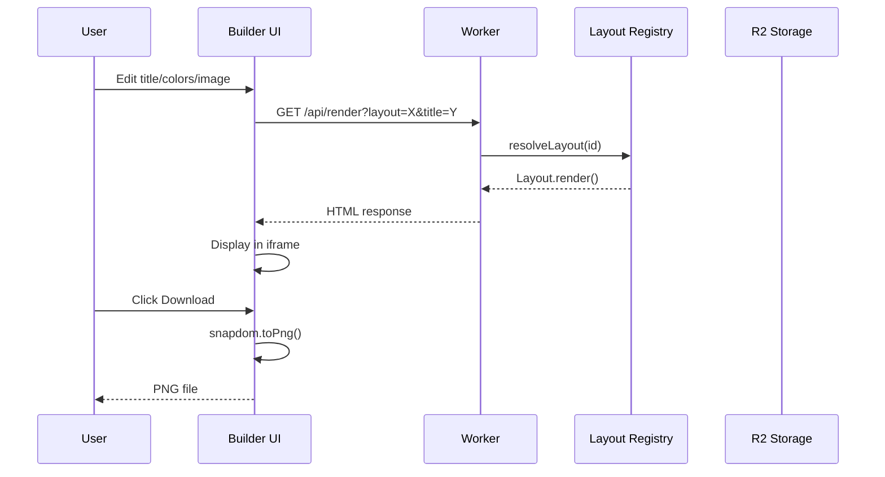
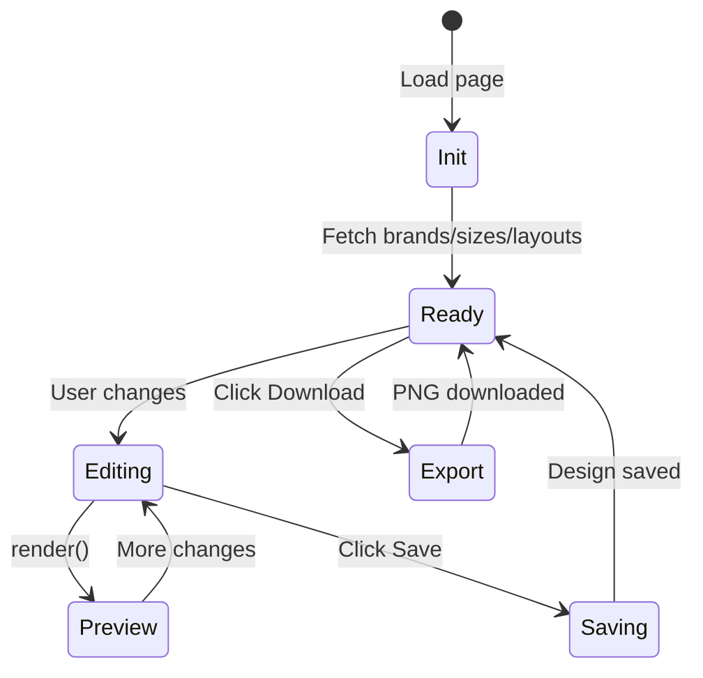

# 01-core-flow

The core pipeline: receive request → resolve layout → render HTML → return/capture PNG. Two paths exist: client-side (snapdom) and server-side (Windmill).

## Request Flow

## Rendering Paths

| Path | Trigger | Method | Use Case |
|------|---------|--------|----------|
| Client | Builder UI | snapdom in browser | Interactive editing |
| Server | API with `?ssr=1` | Windmill/CamoFox | Batch generation |

## State Flow (Builder)

## Key Functions

| Function | Location | Purpose |
|----------|----------|---------|
| `resolveLayout(id)` | `layouts/index.ts` | Get layout by ID |
| `renderInlineToHTML()` | `lib/template-renderer.ts` | Layout → HTML page |
| `renderDesignToHTML()` | `lib/template-renderer.ts` | Saved design → HTML |
| `handleRender()` | `routes/render.ts` | `/api/render` endpoint |

## File Reference

| File | Purpose |
|------|---------|
| `src/routes/builder.ts` | Main UI, state management |
| `src/routes/render.ts` | Render endpoint |
| `src/lib/template-renderer.ts` | HTML generation |

## Cross-References

| Doc | Relation |
|-----|----------|
| [00-architecture-overview](00-architecture-overview.md) | System context |
| [02-layouts-system](02-layouts-system.md) | Layout rendering |
| [05-api-reference](05-api-reference.md) | Endpoint details |
