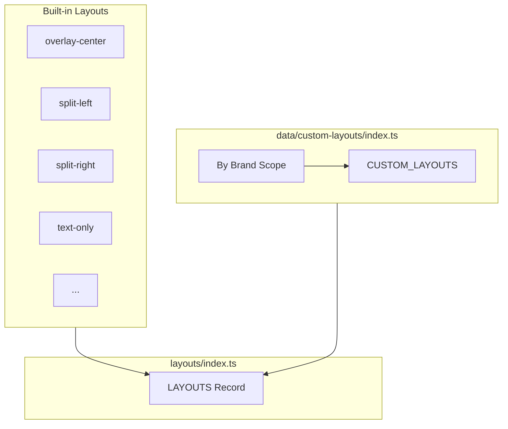

# 02-layouts-system

Layouts are HTML render functions with parameter placeholders. Built-in layouts use inline styles; custom layouts use `{{key}}` template syntax. All layouts merge into one registry.

## Layout Architecture



## Built-in Layouts

| ID | Name | Category | Use Case |
|----|------|----------|----------|
| `overlay-center` | Overlay Center | landscape | Text on background |
| `split-left` | Split Left | landscape | Image left, text right |
| `split-right` | Split Right | landscape | Text left, image right |
| `overlay-bottom` | Overlay Bottom | landscape | Text bar at bottom |
| `card-center` | Card Center | landscape | Image top, text below |
| `text-only` | Text Only | all | Pure text, gradient bg |
| `collage-2` | Collage 2 | landscape | Two images + title |
| `frame` | Frame | all | Image with border |
| `agency-split` | Agency Split | wide | GOHA agency style |

## Custom Layout Structure

```typescript
{
  id: 'my-layout',
  name: 'My Layout',
  brand: 'goha',              // Brand scope
  categories: ['landscape'],
  params: [
    { key: 'title', type: 'text', required: true },
    { key: 'feature_image', type: 'image', searchable: true },
    { key: 'bg_color', type: 'color' },
  ],
  html: '<div id="thumbnail" style="...">{{title}}</div>'
}
```

## Parameter Types

| Type | Description | UI Control |
|------|-------------|------------|
| `text` | String input | Text field |
| `color` | Hex color | Color picker |
| `image` | URL | URL input or search |

## Template Placeholders

| Placeholder | Value |
|-------------|-------|
| `{{width}}` | Thumbnail width px |
| `{{height}}` | Thumbnail height px |
| `{{title}}` | Title text (escaped) |
| `{{subtitle}}` | Subtitle text (escaped) |
| `{{bg_color}}` | Background color |
| `{{title_color}}` | Title color |
| `{{feature_image}}` | Feature image URL |

## Adding Custom Layout

Edit `src/data/custom-layouts/index.ts`:

```typescript
const ALL_LAYOUTS: CustomLayoutData[] = [
  {
    id: 'new-layout',
    name: 'New Layout',
    brand: 'goha',
    categories: ['landscape'],
    params: [...],
    html: '<div id="thumbnail">...</div>'
  },
];
```

## File Reference

| File | Purpose |
|------|---------|
| `src/layouts/index.ts` | Layout registry |
| `src/layouts/*.ts` | Built-in layouts |
| `src/data/custom-layouts/index.ts` | Custom layouts |
| `src/lib/html-helpers.ts` | escapeHtml, sanitizeColor |

## Cross-References

| Doc | Relation |
|-----|----------|
| [01-core-flow](01-core-flow.md) | Render pipeline |
| [03-brand-templates](03-brand-templates.md) | Brand + layout = template |
