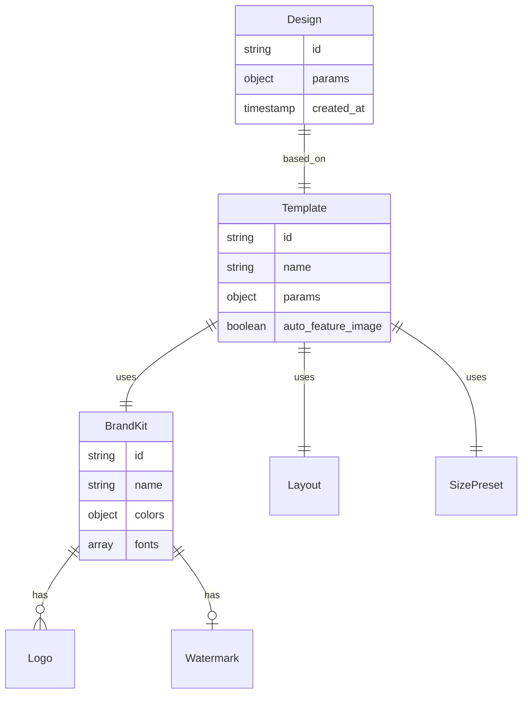

# 03-brand-templates

Brands define visual identity (colors, fonts, logos). Templates combine Brand + Layout + Size for one-click thumbnail presets.

## Entity Relationship



## BrandKit Structure

```typescript
{
  id: 'goha',
  name: 'GOHA',
  colors: {
    primary: '#1a1a3e',
    secondary: '#FFD700',
    accent: '#FF6B35',
    text_light: '#FFFFFF',
    text_dark: '#1a1a3e'
  },
  fonts: {
    heading: 'Montserrat',
    body: 'Be Vietnam Pro'
  },
  logos: [
    { id: 'main', name: 'Main Logo', url: '/brands/goha/logo.svg' }
  ],
  watermark: { url: '/brands/goha/watermark.png' }
}
```

## Size Presets

| ID | Name | Width | Height | Category |
|----|------|-------|--------|----------|
| `fb-post` | Facebook Post | 1200 | 630 | landscape |
| `ig-post` | Instagram Post | 1080 | 1080 | square |
| `yt-thumb` | YouTube Thumbnail | 1280 | 720 | landscape |
| `agency-wide` | Agency Wide | 1300 | 874 | wide |

## Template Structure

Stored in R2 `templates/{id}.json`:

```typescript
{
  id: 'goha-agency',
  name: 'GOHA Agency',
  brand: 'goha',
  layout: 'agency-split',
  size: 'agency-wide',
  params: {
    title: 'Default Title',
    bg_image: '/brands/goha/bg/default.png'
  },
  auto_feature_image: true  // AI search for image
}
```

## Template vs Layout vs Design

| Concept | Definition | Storage |
|---------|------------|---------|
| Layout | Render function | Code |
| Template | Layout + Size + Brand defaults | R2 |
| Design | User's saved config | R2 |

## File Reference

| File | Purpose |
|------|---------|
| `src/data/brand-kits.ts` | Brand definitions |
| `src/data/size-presets.ts` | Size presets |
| `src/routes/templates.ts` | Template CRUD |
| `src/routes/brands.ts` | Brand endpoints |

## Cross-References

| Doc | Relation |
|-----|----------|
| [02-layouts-system](02-layouts-system.md) | Layout rendering |
| [05-api-reference](05-api-reference.md) | CRUD endpoints |
