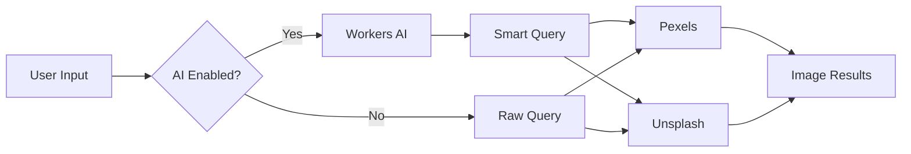

# 04-image-services

Image search via Pexels and Unsplash APIs. Optional AI-powered query generation using Workers AI for smarter search results.

## Service Flow



## API Configuration

| Service | Env Variable | Rate Limit |
|---------|--------------|------------|
| Pexels | `PEXELS_API_KEY` | 200/hr |
| Unsplash | `UNSPLASH_ACCESS_KEY` | 50/hr |
| Workers AI | `AI` binding | Unlimited |

## Search Endpoints

| Endpoint | Service | Purpose |
|----------|---------|---------|
| `GET /api/images/search?q=...` | Pexels | Primary search |
| `GET /api/images/unsplash?q=...` | Unsplash | Alternative |
| `POST /api/ai/search-suggest` | Workers AI | Query enhancement |

## AI Search Query

Generates optimized search terms from title + context:

```typescript
// Input
{ title: "Tối ưu content B2B", brandMood: "professional" }

// Output
"professional business office technology teamwork"
```

## Image Result Format

```typescript
{
  id: string,
  url_thumb: string,   // 200px preview
  url_small: string,   // 400px
  url_full: string,    // Original size
  photographer: string,
  source: 'pexels' | 'unsplash'
}
```

## Auto Feature Image

Templates with `auto_feature_image: true` trigger automatic search:

1. Extract keywords from title
2. Add brand mood from bg_color
3. Search Pexels
4. Use first result as `feature_image`

## File Reference

| File | Purpose |
|------|---------|
| `src/lib/pexels.ts` | Pexels API client |
| `src/lib/unsplash.ts` | Unsplash API client |
| `src/lib/ai-search-query.ts` | AI query generation |
| `src/routes/image-search.ts` | Search endpoint |

## Cross-References

| Doc | Relation |
|-----|----------|
| [01-core-flow](01-core-flow.md) | Part of render pipeline |
| [06-deployment](06-deployment.md) | API key secrets |
