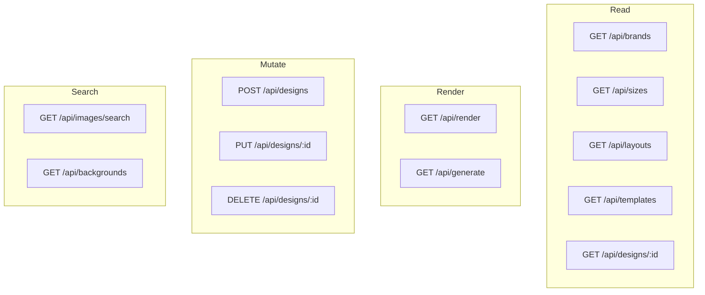

# 05-api-reference

All HTTP endpoints exposed by the SnapKit Worker. Base URL: `https://snapkit.vibery.app`

## Endpoint Overview



## Render Endpoints

| Method | Path | Description |
|--------|------|-------------|
| GET | `/api/render?layout=X&size=Y&title=Z` | Render HTML page |
| GET | `/api/render?d=DESIGN_ID` | Render saved design |
| GET | `/api/render?t=TEMPLATE_ID` | Render from template |
| GET | `/api/generate?...&format=png` | Server-side PNG (Windmill) |

### Render Parameters

| Param | Type | Required | Description |
|-------|------|----------|-------------|
| `layout` | string | Yes* | Layout ID |
| `size` | string | Yes* | Size preset ID |
| `title` | string | No | Title text |
| `subtitle` | string | No | Subtitle text |
| `bg_color` | string | No | Background hex color |
| `feature_image` | string | No | Feature image URL |
| `d` | string | Alt* | Design ID |
| `t` | string | Alt* | Template ID |

## Data Endpoints

| Method | Path | Description |
|--------|------|-------------|
| GET | `/api/brands` | List all brands |
| GET | `/api/sizes` | List size presets |
| GET | `/api/layouts` | List available layouts |
| GET | `/api/layouts/:id` | Get single layout |

## Design CRUD

| Method | Path | Description |
|--------|------|-------------|
| GET | `/api/designs/:id` | Get design |
| POST | `/api/designs` | Create design |
| PUT | `/api/designs/:id` | Update design |
| DELETE | `/api/designs/:id` | Delete design |

### Design Body

```json
{
  "size": { "preset": "fb-post", "width": 1200, "height": 630 },
  "layout": "split-left",
  "brand": "goha",
  "params": {
    "title": "Hello",
    "bg_color": "#1a1a3e",
    "feature_image": "https://..."
  }
}
```

## Template CRUD

| Method | Path | Description |
|--------|------|-------------|
| GET | `/api/templates` | List templates |
| GET | `/api/templates/:id` | Get template |
| POST | `/api/templates` | Create template |
| PUT | `/api/templates/:id` | Update template |
| DELETE | `/api/templates/:id` | Delete template |

## Image Search

| Method | Path | Description |
|--------|------|-------------|
| GET | `/api/images/search?q=X` | Search Pexels |
| GET | `/api/backgrounds` | List brand backgrounds |
| GET | `/api/backgrounds?tag=X` | Filter by tag |

## Response Format

All responses return JSON:

```json
{
  "success": true,
  "data": { ... }
}
```

Error:
```json
{
  "error": "Error message",
  "status": 400
}
```

## File Reference

| File | Purpose |
|------|---------|
| `src/index.ts` | Router |
| `src/routes/*.ts` | Endpoint handlers |

## Cross-References

| Doc | Relation |
|-----|----------|
| [01-core-flow](01-core-flow.md) | Request handling |
| [03-brand-templates](03-brand-templates.md) | Data models |
