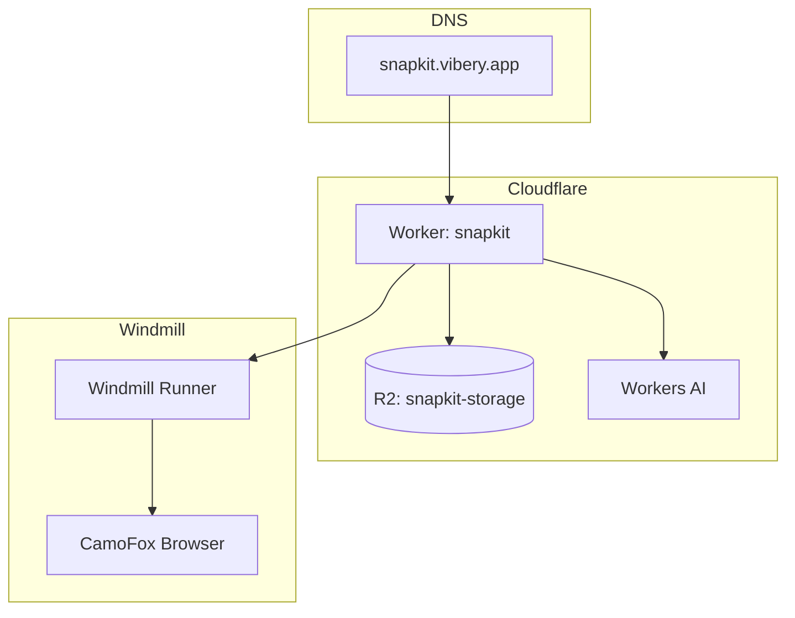

# 06-deployment

SnapKit runs on Cloudflare Workers with R2 storage. Server-side rendering uses Windmill with CamoFox browser.

## Infrastructure



## Wrangler Config

| Key | Value |
|-----|-------|
| `name` | snapkit |
| `main` | src/index.ts |
| `compatibility_date` | 2024-12-01 |
| `assets.directory` | ./public |

## Bindings

| Binding | Type | Purpose |
|---------|------|---------|
| `R2_BUCKET` | R2 | Designs, templates, assets |
| `AI` | Workers AI | Search query generation |
| `PEXELS_API_KEY` | Env var | Image search |

## R2 Structure

```
snapkit-storage/
├── designs/{id}.json
├── templates/{id}.json
├── brands/{brand}/
│   ├── logos/
│   └── bg/
└── exports/{id}.png (cached)
```

## Deploy Commands

```bash
# Development
npm run dev          # localhost:8787

# Production
npm run deploy       # wrangler deploy

# Secrets
wrangler secret put PEXELS_API_KEY
wrangler secret put UNSPLASH_ACCESS_KEY
```

## Windmill SSR

For server-side PNG generation:

| Config | Value |
|--------|-------|
| Base URL | `WINDMILL_BASE` env |
| Token | `WINDMILL_TOKEN` secret |
| Script | `f/snapkit/render_png` |

## Static Assets

Served from `public/` via Wrangler assets:

```
public/
├── fonts/
│   ├── Montserrat-Bold.woff2
│   └── BeVietnamPro-Regular.woff2
├── brands/
│   └── goha/
└── backgrounds/
```

## File Reference

| File | Purpose |
|------|---------|
| `wrangler.toml` | Worker config |
| `src/lib/windmill-client.ts` | SSR client |
| `src/lib/r2-helpers.ts` | R2 utilities |

## Cross-References

| Doc | Relation |
|-----|----------|
| [00-architecture-overview](00-architecture-overview.md) | System context |
| [04-image-services](04-image-services.md) | API keys |
